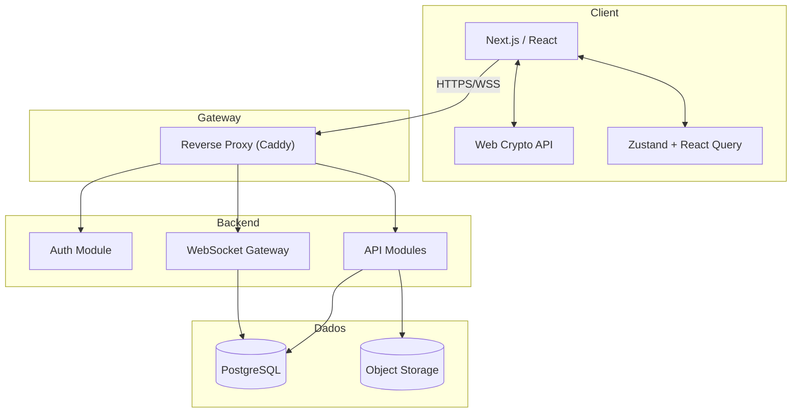
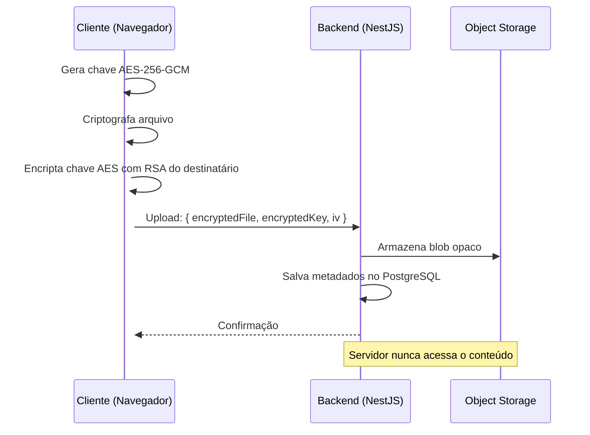

# 01 - Arquitetura

## Padrão: Monolito Modular

O Fatesck adota **Monolito Modular** com arquitetura **Client-Server**, evoluível para microsserviços.

> [!tip] Por que Monolito Modular?
> - Iteração rápida com separação clara de responsabilidades
> - Módulos NestJS podem ser extraídos quando necessário
> - Evita sobrecarga operacional de orquestração
> - E2E no cliente simplifica a superfície de ataque do servidor

## Diagrama de Níveis

## Módulos do Backend (NestJS)

| Módulo | Responsabilidade | Endpoints |
|--------|-----------------|-----------|
| **AuthModule** | Login, registro, OAuth, JWT, refresh | `/auth/*` |
| **UsersModule** | Perfis, chaves públicas | `/users/*` |
| **ClassesModule** | Turmas, matrículas | `/classes/*` |
| **AssignmentsModule** | Atividades, avaliações | `/assignments/*` |
| **SubmissionsModule** | Entregas, feedback, notas | `/submissions/*` |
| **MessagesModule** | Roteamento de blobs E2E | `/messages/*` |
| **FilesModule** | Upload/download criptografados | `/files/*` |
| **NotificationsModule** | Push + WebSocket events | `/notifications/*` |

## Fluxos de Dados

> [!example] REST
> 1. Frontend criptografa payload (se necessário)
> 2. Envia com JWT no header
> 3. Gateway valida TLS, rate limit, CSP
> 4. Backend valida JWT → RBAC → DTO → Serviço → Prisma → DB
> 5. Resposta JSON tipada

> [!example] WebSocket
> 1. Frontend criptografa mensagem no navegador
> 2. Envia via WebSocket (payload opaco + metadata)
> 3. Servidor encaminha via room — **sem descriptografar**
> 4. Destinatário descriptografa no navegador

## Gerenciamento de Arquivos

## Referências

- Visão geral: [[00 - Visão Geral]]
- Stack: [[04 - Stack Tecnológica]]
- Infra: [[05 - Infraestrutura]]
- Segurança E2E: [[02 - Segurança E2E]]
- Dados: [[03 - Modelo de Dados]]
