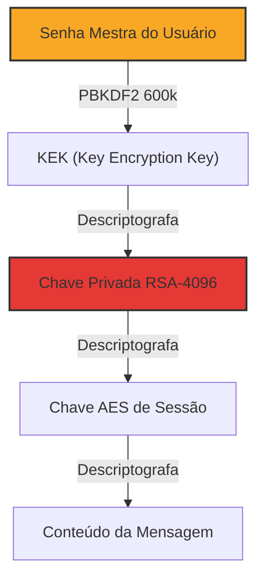

# 02 - Segurança E2E

## Princípio

> [!danger] Zero-Knowledge
> O servidor **nunca** acessa conteúdo de mensagens, arquivos ou atividades. Toda criptografia ocorre **exclusivamente no cliente**.

## Algoritmos

| Propósito | Algoritmo | Parâmetros |
|-----------|-----------|------------|
| Simétrica (mensagens) | AES-GCM | 256 bits |
| Assimétrica (troca de chaves) | RSA-OAEP | 4096 bits |
| Derivação de chaves | PBKDF2 | SHA-256, 600k iterações |
| Hash de senhas | Argon2id | OWASP atual |
| Assinatura digital | ECDSA | P-256 |
| IV/Nonce | Aleatório | 12 bytes |

> [!question] Por que não Signal Protocol?
> O Signal Protocol é excelente, mas requer sincronização de estado complexo. Para o Fatesck, **RSA + AES-GCM** via Web Crypto API é suficiente e mais simples. Forward secrecy pode ser adicionada futuramente com Double Ratchet em WebAssembly.

## Hierarquia de Chaves

## Fluxo de Mensagem E2E

O fluxo completo está detalhado em [[Fluxo - Mensagem E2E]].

Resumo:
1. Remetente gera chave AES aleatória por mensagem
2. Criptografa corpo com AES-GCM
3. Criptografa chave AES com **chave pública** do destinatário (RSA-OAEP)
4. Assina com chave privada (ECDSA)
5. Servidor roteia o blob — **sem acesso ao conteúdo**
6. Destinatário descriptografa com sua **chave privada RSA**

## Autenticação

Detalhes em [[Autenticação]]. Resumo:
- **access_token**: JWT em memória do frontend (15 min)
- **refresh_token**: Opaco em cookie HttpOnly (7 dias, rotação por uso)
- Chave privada RSA: mantida em memória ou IndexedDB (criptografada)

## Threat Model

> [!failure] Ameaças Residuais — Não Mitigadas
> - **Comprometimento do dispositivo**: keylogger/malware acessa chaves
> - **Perda da senha**: sem backdoor → perda total do acesso
> - **Metadados**: servidor sabe **quem** fala com **quem** e **quando**
> - **Object Storage**: nome, tamanho e timestamps dos arquivos são visíveis

Modelo completo → [[Threat Model]]

## Checklist

- [ ] Geração de chaves RSA-4096 no cliente
- [ ] PBKDF2 com 600.000 iterações
- [ ] AES-GCM 256 para mensagens
- [ ] RSA-OAEP para wrapping de chaves
- [ ] ECDSA P-256 para assinaturas
- [ ] JWT + refresh token rotation
- [ ] Cookie HttpOnly para refresh
- [ ] CSP, HSTS, X-Frame-Options
- [ ] Rate limiting em autenticação
- [ ] TLS 1.3 obrigatório
- [ ] Argon2id para senhas no servidor
- [ ] Logs JSON estruturados
- [ ] Backup de recuperação (frase de segurança)
