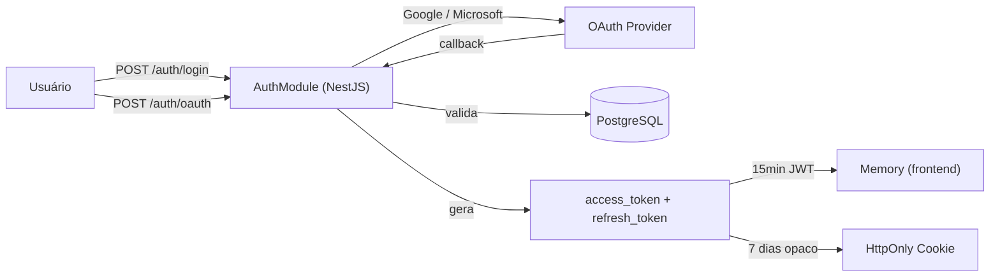

# Autenticação

## Arquitetura



## Detalhes do JWT

```json
{
  "sub": "user-uuid",
  "email": "aluno@exemplo.com",
  "roles": ["aluno"],
  "kid": "key-v1-20260406",
  "iat": 1744000000,
  "exp": 1744000900,
  "iss": "fatesck-auth"
}
```

## Ciclo de Tokens

| Fase | Ação | Duração |
|------|------|---------|
| **Login** | Gera `access_token` (JWT) + `refresh_token` (opaco) | 15min / 7 dias |
| **Request** | Envia `Authorization: Bearer <access_token>` | — |
| **Expiração access** | `POST /auth/refresh` com refresh token → novo par | — |
| **Expiração refresh** | Sessão expira, requer re-login | 7 dias |
| **Logout** | Invalida `refresh_token` no servidor | Imediato |
| **Rotação** | Cada refresh gera novo `refresh_token` | Por uso |

## Armazenamento dos Tokens

| Token | Onde | Por quê |
|-------|------|---------|
| `access_token` | **Memory** (variável JS) | XSS-proof; expira em 15min |
| `refresh_token` | **HttpOnly, Secure, SameSite=Strict** cookie | Não acessível via JS |
| Chave privada RSA | **Memory** ou **IndexedDB** (criptografada) | Balancear segurança/UX |

## Medidas de Segurança

| Medida | Descrição |
|--------|-----------|
| **CSRF** | SameSite=Strict + double submit cookie |
| **Brute Force** | 5 tentativas/min por IP + lockout após 10 falhas |
| **Replay** | JWT com `jti` único; refresh tokens single-use |
| **XSS** | CSP restritiva, sem `innerHTML`, sanitização |
| **Key Rotation** | Chaves RSA rotacionadas a cada 90 dias |
| **2FA (futuro)** | TOTP via QR Code |

> [!tip] Futuro
> Implementar TOTP como segundo fator de autenticação para proteção adicional.

## Referências

- [[02 - Segurança E2E]] para criptografia de mensagens
- [[Modelo de Chaves]] para chaves criptográficas
- [[Fluxo - Mensagem E2E]] para envio de mensagens
