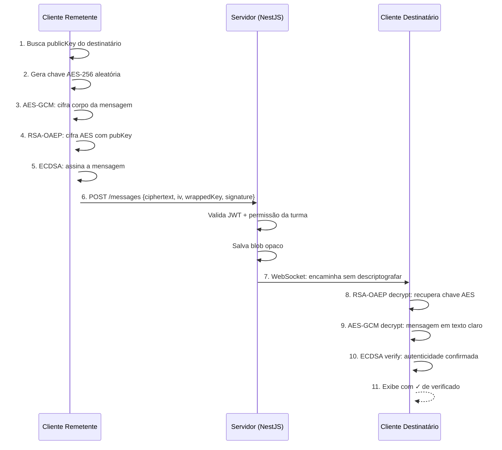

# Fluxo — Mensagem E2E

## Envio de Mensagem (Aluno → Professor)



## Payload Enviado ao Servidor

```json
{
  "toUserId": "prof-uuid",
  "classId": "turma-uuid",
  "ciphertext": "<base64>",
  "iv": "<base64>",
  "wrappedKey": "<base64>",
  "signature": "<base64>",
  "senderKeyId": "id-da-chave-aluno",
  "contentType": "text"
}
```

> [!important] O servidor NUNCA descriptografa
> O payload é tratado como um **blob opaco**. O servidor apenas valida permissões e roteia.

## Mensagens em Grupo

Para grupos (turma inteira):

1. Remetente gera **uma** chave AES para a mensagem
2. Criptografa a mensagem com essa chave
3. Para **cada destinatário**, criptografa a chave AES com a chave pública daquele destinatário
4. Envia: `{ ciphertext, iv, recipients: [{userId, wrappedKey}, ...], signature }`

> [!tip] Otimização para grupos grandes
> Para >50 membros: usar **chave simétrica de grupo** distribuída via RSA individual. Reduz de O(N²) para O(N) operações no cliente.

## Metadados Transmitidos (não criptografados)

O WebSocket transmite estes metadados em texto claro:

- `roomId` — identificador do canal/turma
- `senderId` — quem enviou
- `messageId` — UUID
- `timestamp` — quando foi enviada
- `iv` — vetor de inicialização (público)

## Referências

- Hierarquia de chaves: [[Modelo de Chaves]]
- Autenticação: [[Autenticação]]
- Visão geral E2E: [[02 - Segurança E2E]]
- Entidade Messages: [[03 - Modelo de Dados]]
