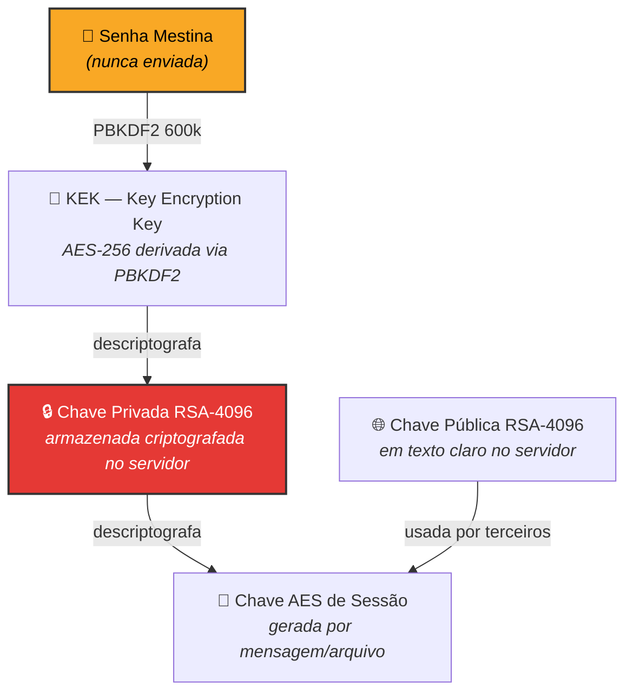

# Modelo de Chaves

## Hierarquia

## Fluxo de Registro

1. Usuário cria conta (email + senha)
2. Frontend gera par **RSA-4096** no navegador
3. Frontend deriva chave da senha com **PBKDF2** (600k iterações, salt aleatório)
4. Frontend criptografa `privateKey` com a chave derivada (AES-GCM)
5. Envia ao servidor:
   - `publicKey` (texto claro)
   - `encryptedPrivateKey` + `iv` (blob opaco)
   - `pbkdf2Salt`

## Tabela `UserKeys`

| Campo | Tipo | Descrição |
|-------|------|-----------|
| `id` | UUID (PK) | Identificador da chave |
| `userId` | UUID (FK → Users) | Dono |
| `publicKey` | TEXT (PEM) | Chave pública RSA-4096 |
| `encryptedPrivateKey` | TEXT (Base64) | Chave privada criptografada |
| `encryptionIv` | TEXT (Base64) | IV da criptografia |
| `pbkdf2Salt` | TEXT (Base64) | Salt do PBKDF2 |
| `isActive` | BOOLEAN | Se é a chave atualmente em uso |
| `createdAt` | TIMESTAMP | Data de geração |
| `rotatedAt` | TIMESTAMP | Data de rotação (nullable) |

> [!warning] Importante
> O servidor **nunca** vê a senha ou a `privateKey` em texto claro.

## Rotação de Chaves

- Chaves são rotacionadas a cada **90 dias** ou após suspeita de comprometimento
- Mensagens antigas são descriptografadas com a chave antiga (o `senderKeyId` identifica qual chave foi usada)
- O campo `rotatedAt` registra quando a rotação ocorreu

## Armazenamento da Chave Privada no Cliente

| Estratégia | Segurança | UX |
|------------|-----------|-----|
| **Memória RAM** | Alta (perde ao fechar aba) | Baixa (digita senha a cada sessão) |
| **IndexedDB** (criptografada) | Média (persistência local) | Alta (mantém sessão) |

## Referências

- [[03 - Modelo de Dados]] para tabelas
- [[Fluxo - Mensagem E2E]] para uso das chaves
- [[Autenticação]] para fluxo de login
