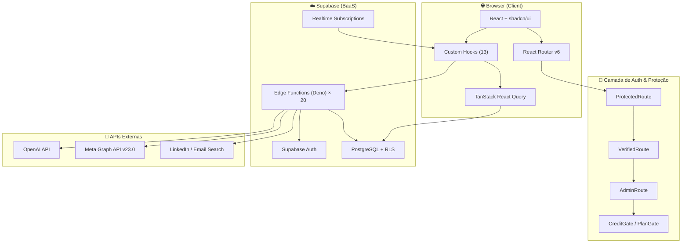
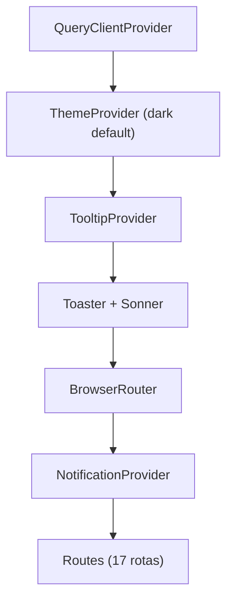
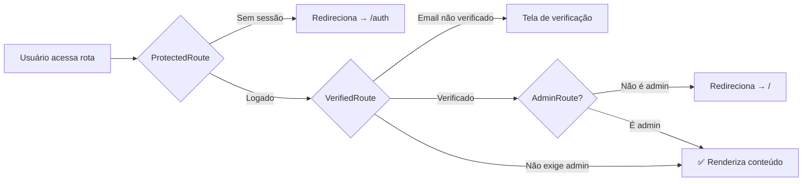
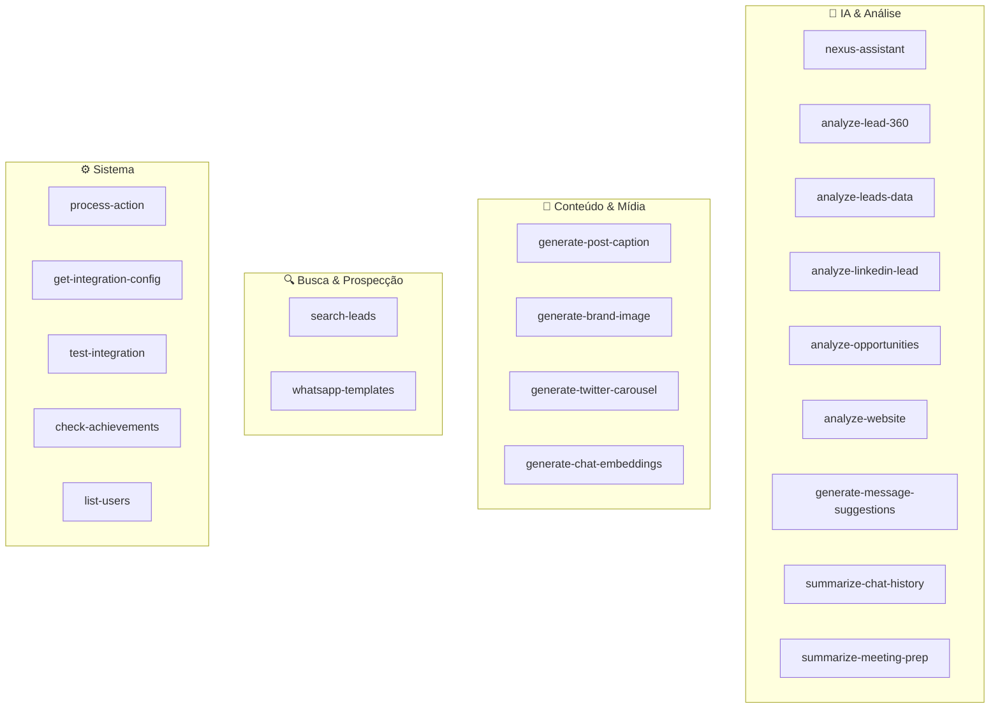
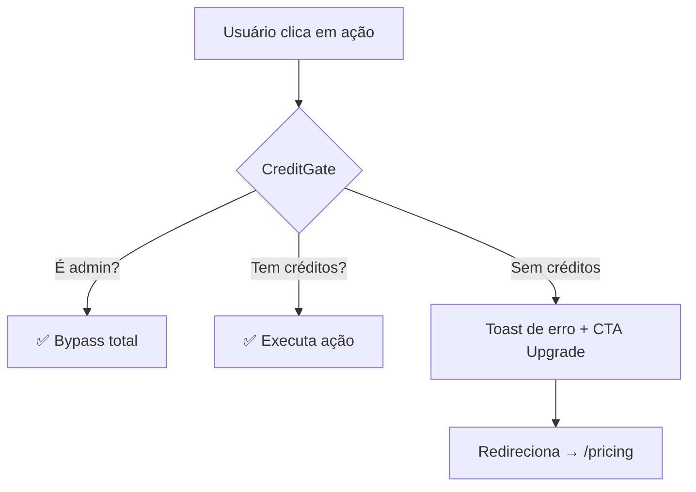

---
tags:
  - nexus
  - arquitetura
  - sistema
created: 2026-04-03
parent: "[[Nexus - Index do Projeto]]"
---

# 🏗️ Nexus — Arquitetura do Sistema

> Esta nota detalha como as peças do [[Nexus - Index do Projeto|Nexus]] se conectam, desde a renderização no browser até a persistência no banco de dados.

---

## Visão Geral — Diagrama de Camadas



---

## 1. Camada de Apresentação (Frontend)

### Ponto de Entrada
```
index.html → main.tsx → App.tsx
```
- `main.tsx` renderiza `<App />` no root DOM
- `App.tsx` configura os providers em cascata:



### Sistema de Rotas

| Tipo | Rotas | Proteção |
|:---|:---|:---|
| **Públicas** | `/auth`, `/signup` | Nenhuma |
| **Semi-protegidas** | `/pricing` | `ProtectedRoute` (login) |
| **Seguras** | `/`, `/dashboard`, `/leads`, `/leads/:id`, `/opportunities`, `/opportunities/:id`, `/analytics`, `/performance`, `/meetings`, `/integrations` | `SecureRoute` (login + email verificado) |
| **Admin** | `/posts`, `/logs`, `/whatsapp-templates` | `SecureRoute` + `AdminRoute` |

### Guardas de Rota (Route Guards)



### Layout

O sistema usa dois layouts:
1. **`MainLayout`** — Para a maioria das páginas (Dashboard, Leads, Analytics, etc.)
   - Sidebar colapsável (`AppSidebar`) + conteúdo principal em container
2. **Layout do Chat** — Layout customizado na página `Chat.tsx`
   - `AppSidebar` + `ChatSidebar` (histórico de conversas) + `ChatConversation`

A **`AppSidebar`** filtra itens de navegação baseado no `useUserRole()`:
- Usuários comuns **não veem**: Postagens IA, Logs API, WhatsApp Templates

---

## 2. Camada de Lógica de Negócio (Hooks)

Os **Custom Hooks** são o coração da lógica de negócio no frontend. Eles encapsulam acesso a dados, state management e side effects.

| Hook | Responsabilidade | Padrão |
|:---|:---|:---|
| `useUserRole` | Busca perfil (role, plan, credits) + realtime | State + Realtime Subscription |
| `useUserCredits` | Saldo, dedução e verificação de créditos | State + RPC (`deduct_credits`) |
| `useStreamingChat` | Streaming SSE com o Nexus Assistant | Fetch + ReadableStream |
| `useNexusConversations` | CRUD de conversas do chat | React Query mutations |
| `useLinkedInSearch` | Prospecção no LinkedIn via Edge Function | State machine |
| `useEmailSearch` | Busca por e-mail de decisores | State + Edge Function |
| `useWhatsappTemplates` | CRUD de templates WhatsApp | React Query + Edge Function |
| `useIntegrationConfigs` | Configurações de integração por tenant | React Query |
| `useLeadAssignmentNotifications` | Push quando lead é atribuído | Realtime |
| `usePushNotifications` | Web Push Notifications | Browser API |
| `useDebounce` | Debounce genérico | Utility |
| `use-mobile` | Detecta viewport mobile | Media Query |
| `use-toast` | Sistema de toasts | State |

> [!tip] Padrão dominante
> A maioria dos hooks segue: **`supabase.functions.invoke()` → React Query → Invalidação de cache + Toast feedback**

---

## 3. Camada de Backend (Supabase)

### 3.1 Autenticação

- **Supabase Auth** com persistência em `localStorage`
- Sessão auto-refresh via `autoRefreshToken: true`
- Trigger `on_auth_user_created` cria automaticamente o perfil do usuário
- O CEO (email hardcoded `rhyanpaablo@gmail.com`) recebe `role: admin` automaticamente

### 3.2 Banco de Dados (PostgreSQL)

**Tabelas principais** (extraídas de `types.ts` — schema real):

| Tabela | Propósito |
|:---|:---|
| `profiles` | Perfil SaaS (role, plan_type, credits, stripe_customer_id, mp_user_id) |
| `leads` | Base de leads do CRM (22+ campos) |
| `lead_ai_analyses` | Análises de IA sobre leads |
| `lead_interactions` | Timeline de interações |
| `pre_leads` | Pré-leads prospectados (Google Maps, etc.) |
| `pre_lead_linkedin` | Perfis do LinkedIn Scout |
| `integration_configs` | Credenciais de integrações por tenant (JSON) |
| `nexus_conversations` | Histórico de conversas do chat (messages em JSONB) |
| `user_credits` / `credit_transactions` | Saldo e histórico de créditos |
| `marketing_posts` | Posts de marketing (Kanban) |
| `reunioes_sdr` | Reuniões de vendas |
| `subscriptions` | Assinaturas de pagamento (FK → profiles) |
| `documents` | Embeddings para busca semântica |

> Para schema completo: [[Nexus - Modelo de Dados e Banco]]

**Row Level Security (RLS):**
- `admin` → acesso total (`ALL`) a todas as tabelas
- `client` → isolamento por `user_id = auth.uid()`
- Função helper: `is_admin(user_id)` verifica role no banco

### 3.3 Edge Functions (20 funções Deno)



**Padrão de implementação das Edge Functions:**
1. CORS preflight (OPTIONS)
2. Extrair JWT do header `Authorization: Bearer`
3. Autenticar via `supabase.auth.getClaims(token)`
4. Buscar credenciais/config via `integration_configs`
5. Executar lógica de negócio
6. Retornar payload JSON normalizado

---

## 4. Camada de Middleware Visual

O Nexus implementa um sistema de proteção duplo: **backend (Zero Trust)** e **frontend (UX)**.

### Componentes de Middleware

| Componente | Função |
|:---|:---|
| `CreditGate` | Envolve botões/ações e verifica créditos antes de executar |
| `PlanGate` | Mostra/esconde funcionalidades baseado no plano do usuário |
| `UpgradeBanner` | Banner visual de upgrade quando funcionalidade é bloqueada |



**Hierarquia de planos:**
```
free (0) → basic (1) → pro/premium (2) → enterprise (3)
```

---

## 5. Integrações Externas

| Serviço | Uso | Padrão de Conexão |
|:---|:---|:---|
| **OpenAI** | Nexus Chat, análises, geração de conteúdo | Edge Function → API key via env |
| **Meta Graph API** | WhatsApp Templates CRUD | Edge Function → token via `integration_configs` |
| **LinkedIn** | Prospecção de decisores | Edge Function → busca parametrizada |
| **Stripe** (futuro) | Pagamentos e assinaturas | Colunas preparadas em `profiles` |

---

## Notas Relacionadas

- [[Nexus - Fluxo de Dados]] — Como a informação percorre cada camada
- [[Nexus - Mapeamento de Arquivos]] — Detalhamento arquivo por arquivo
- [[Nexus - Index do Projeto]] — Visão geral e status
