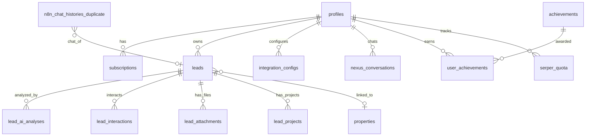

---
tags:
  - nexus
  - database
  - schema
created: 2026-04-03
updated: 2026-04-06
parent: "[[Nexus - Index do Projeto]]"
---

# 📊 Nexus — Modelo de Dados e Banco

> **Fonte de verdade:** `src/integrations/supabase/types.ts` (42KB, gerado automaticamente pelo Supabase).
> Este documento mapeia as **tabelas reais** do PostgreSQL do projeto.

---

## 🏢 Core — Perfil e Conta SaaS

### `profiles`
> Tabela central do multi-tenant. Vinculada a `auth.users` via FK cascade.

| Coluna | Tipo | Descrição |
|:---|:---|:---|
| `id` | UUID (PK) | `= auth.users.id` |
| `role` | enum `user_role` | `admin` ou `client` |
| `plan_type` | enum `plan_type` | `free`, `basic`, `premium`, `pro`, `enterprise` |
| `credits` | integer | Saldo de créditos para ações de IA |
| `is_verified` | boolean | Email verificado? |
| `stripe_customer_id` | text | ID do cliente no Stripe |
| `subscription_status` | text | Status da assinatura |
| `mp_user_id` | text | ID do usuário no MercadoPago |
| `last_synced_at` | timestamptz | Última sincronização com gateway |
| `created_at` / `updated_at` | timestamptz | Timestamps |

### `subscriptions`
> Assinaturas de pagamento.

| Coluna | Tipo | Descrição |
|:---|:---|:---|
| `id` | UUID (PK) | — |
| `user_id` | UUID (FK → `profiles`) | Dono da assinatura |
| `plan_id` | text | ID do plano contratado |
| `status` | text | Status da assinatura |
| `payment_method` | text | Método de pagamento |
| `preference_id` | text | ID de preferência (MercadoPago) |
| `external_reference` | text | Referência externa |

### `user_credits`
> Tabela auxiliar de saldo de créditos (alternativa ao campo em `profiles`).

| Coluna | Tipo | Descrição |
|:---|:---|:---|
| `user_id` | UUID | — |
| `balance` | integer | Saldo atual |

### `credit_transactions`
> Histórico de consumo de créditos.

| Coluna | Tipo | Descrição |
|:---|:---|:---|
| `user_id` | UUID | Quem consumiu |
| `action_type` | text | Tipo da ação |
| `amount` | integer | Quantidade debitada |
| `balance_before` / `balance_after` | integer | Saldo antes/depois |
| `description` | text | Descrição da ação |

### `user_roles`
> Tabela separada de roles (enum `app_role`: admin, staff, user).

### `waitlist`
> Lista de espera para novos usuários (nome, email, empresa, whatsapp, 3 perguntas).

---

## 👤 CRM — Leads e Prospecção

### `leads`
> A alma do sistema. Cada lead pertence a um `user_id`.

| Coluna | Tipo | Descrição |
|:---|:---|:---|
| `id` | UUID (PK) | — |
| `user_id` | UUID | Dono do lead (tenant) |
| `name` | text (required) | Nome do lead/empresa |
| `email` / `phone` | text | Contato |
| `segmento` | text | Segmento de atuação |
| `cargo_lead` | text | Cargo do contato |
| `status` | text | Ex: "Novo", "Primeiro contato", "Qualificado" |
| `oportunidade` | text | Oportunidade identificada |
| `message` | text | Mensagem/resumo |
| `informacoes` | text | Informações adicionais |
| `linkedin_url` / `instagram_url` | text | Redes sociais |
| `source_lead` | text | Fonte do lead |
| `main_pain` | text | Principal dor/necessidade |
| `budget_estimate` | numeric | Estimativa de orçamento |
| `close_probability` | numeric | Probabilidade de fechamento |
| `meeting_date` / `meet_link` | text | Dados de reunião |
| `assigned_to` | UUID | Closer atribuído |
| `team_size` / `service_volume` | text | Qualificação do lead |
| `property_id` | UUID (FK → `properties`) | Imóvel vinculado (se aplicável) |

### `lead_ai_analyses`
> Histórico de análises de IA sobre leads.

| Coluna | Tipo | Descrição |
|:---|:---|:---|
| `lead_id` | UUID (FK → `leads`) | Lead analisado |
| `analysis_type` | text | Tipo de análise |
| `analysis_content` | text | Conteúdo/resultado da análise |
| `created_by` | UUID | Quem solicitou |

### `lead_interactions`
> Timeline de interações com o lead.

| Coluna | Tipo | Descrição |
|:---|:---|:---|
| `lead_id` | UUID (FK → `leads`) | — |
| `interaction_type` | text | Tipo (call, email, meeting, etc.) |
| `title` / `description` | text | Detalhes |
| `ai_summary` | text | Resumo gerado por IA |
| `metadata` | JSONB | Dados extras |

### `lead_attachments`
> Arquivos anexados a leads (documentos, imagens).

### `lead_projects`
> Projetos associados a leads (com valor monetário).

### `favorite_message_templates`
> Templates de mensagem salvos pelo usuário.

| Coluna | Tipo | Descrição |
|:---|:---|:---|
| `user_id` | UUID | Dono |
| `title` / `message` | text | Conteúdo |
| `category` | text | Categoria |

---

## 🎯 Oportunidades e Pré-leads

### `pre_leads`
> Pré-leads prospectados (Google Maps, busca genérica).

| Coluna | Tipo | Descrição |
|:---|:---|:---|
| `nome` | text (required) | Nome do prospect |
| `origem` | text (required) | Fonte (ex: "google_maps") |
| `categoria` / `cidade` / `estado` / `pais` | text | Localização |
| `latitude` / `longitude` | numeric | Geolocalização |
| `score` | numeric | Score de qualidade |
| `status` | text | Status de prospecção |
| `website` / `telefone` | text | Contato |
| `query_origem` | text | Query que gerou o resultado |
| `user_id` | UUID | Dono |

### `pre_lead_linkedin`
> Perfis encontrados via LinkedIn Scout.

| Coluna | Tipo | Descrição |
|:---|:---|:---|
| `name` / `title` / `snippet` | text | Dados do perfil |
| `link` / `image` | text | URL e foto |
| `lead_e-mail_01` / `lead_e-mail_02` | text | Emails encontrados |
| `phone_number_01` / `phone_number_02` | text | Telefones |
| `has_more_results` | boolean | Flag de paginação |
| `start_index` | integer | Índice de busca |
| `user_id` | UUID | Dono |

---

## 📅 Reuniões

### `reunioes_sdr`
> Reuniões de SDR/vendas.

| Coluna | Tipo | Descrição |
|:---|:---|:---|
| `lead_id` / `lead_name` | — | Lead vinculado |
| `empresa` / `cargo` / `email` | text | Dados do contato |
| `meeting_date` / `meet_link` | text | Data e link |
| `informacoes` | text | Briefing |
| `oportunidades_identificadas` | text | Oportunidades mapeadas |
| `status` | text | Status da reunião |
| `user_id` | UUID | Responsável |

---

## 📝 Conteúdo e Marketing

### `marketing_posts`
> Posts de marketing gerenciados via Kanban.

| Coluna | Tipo | Descrição |
|:---|:---|:---|
| `title` / `description` | text | Conteúdo |
| `status` | text | Status no kanban |
| `platform` | text | Plataforma alvo |
| `image_url` | text | Imagem do post |
| `scheduled_date` | timestamptz | Data de publicação |

### `posts`
> Posts gerados com IA (tema, legenda, imagem, fontes).

### `generated_images`
> Imagens geradas pela IA (incluindo carrosséis com `carousel_group_id`).

### `brand_identity`
> Identidade visual por usuário (3 cores + logo URL).

---

## ⚙️ Sistema e Infraestrutura

### `integration_configs`
> Credenciais de integrações por tenant.

| Coluna | Tipo | Descrição |
|:---|:---|:---|
| `user_id` | UUID | Dono (tenant) |
| `integration_key` | text | Ex: `"whatsapp"` |
| `config` | JSONB | `{ waba_id, access_token }` |
| `is_active` | boolean | Status |

> **Unique constraint:** `(user_id, integration_key)` — cada tenant tem uma config por integração.

### `serper_quota`
> Controle de cota diária para buscas via Serper.dev (usado por `search-leads`).

| Coluna | Tipo | Descrição |
|:---|:---|:---|
| `user_id` | UUID | Quem realizou a busca |
| `date` | date | Data de controle (YYYY-MM-DD) |
| `requests_used` | integer | Requisições feitas hoje |
| `requests_limit` | integer | Limite diário (padrão: 1000) |
| `is_quota_exhausted` | boolean | Se atingiu o limite |

> **Unique constraint:** `(user_id, date)` — uma linha por usuário por dia.

### `api_logs`
> Logs de chamadas de Edge Functions (custos, tokens, duração).

### `achievements` / `user_achievements`
> Sistema de gamificação — conquistas definidas e atribuídas a usuários.

### `sales_goals`
> Metas de vendas (tipo, período, valor alvo, valor atual).

### `documents`
> Documentos para busca semântica com embeddings.

| Coluna | Tipo | Descrição |
|:---|:---|:---|
| `content` | text | Conteúdo textual |
| `embedding` | vector | Embedding para similaridade |
| `metadata` | JSONB | Metadados |

### `properties`
> Tabela de imóveis (uso imobiliário — legado ou nicho específico).

### `solicitacoes`
> Solicitações operacionais (legado — envolve veículos, motoristas, cobranças).

---

## 📡 Chat e Histórico

### `nexus_conversations`
> Conversas do Nexus Chat (IA).

| Coluna | Tipo | Descrição |
|:---|:---|:---|
| `user_id` | UUID | Dono |
| `title` | text | Título da conversa |
| `messages` | JSONB | Array de `{ role, content, timestamp }` |

### `n8n_chat_histories` / `n8n_chat_histories_duplicate` / `n8n_chat_histories_servix`
> Históricos de chat de automações n8n (integração com WhatsApp e outros canais).
> `n8n_chat_histories_duplicate` tem FK para `leads` (vincula conversa ao lead).

### `Leads WhatsApp- RP`
> Leads capturados via WhatsApp (com `session_id` como chave).

---

## 🗂️ Views

### `leads_with_chat_history`
> View que junta `leads` com contagem de mensagens do chat n8n.

---

## 🔑 Enums

| Enum | Valores |
|:---|:---|
| `user_role` | `admin`, `client` |
| `plan_type` | `free`, `basic`, `premium`, `pro`, `enterprise` |
| `app_role` | `admin`, `staff`, `user` |

---

## 📐 Diagrama de Relacionamentos (Simplificado)

---

## Notas Relacionadas

- [[Nexus - Regras de Negócio e Segurança]] — RLS, créditos e gates
- [[Nexus - Arquitetura]] — Como as camadas acessam o banco
- [[Nexus - Stack Tecnológica]] — Tecnologias do backend
- [[Nexus - Index do Projeto]] — Hub central
