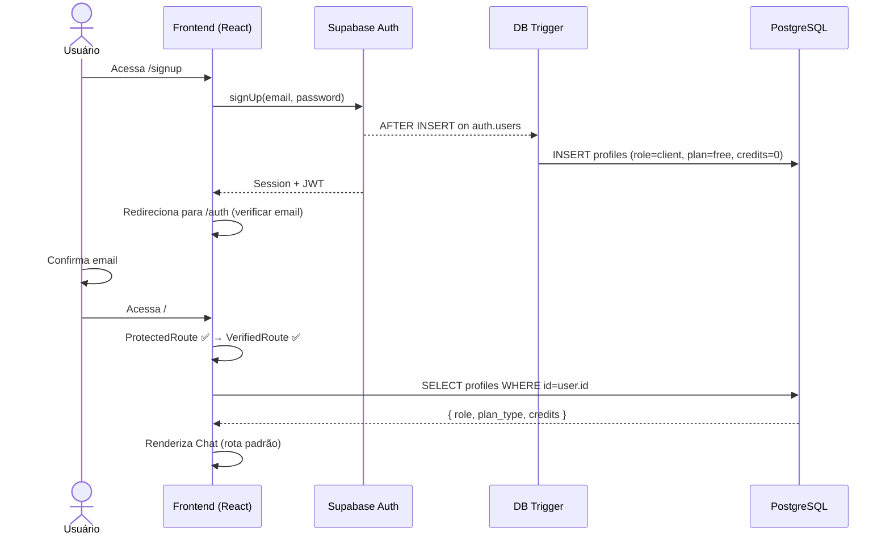
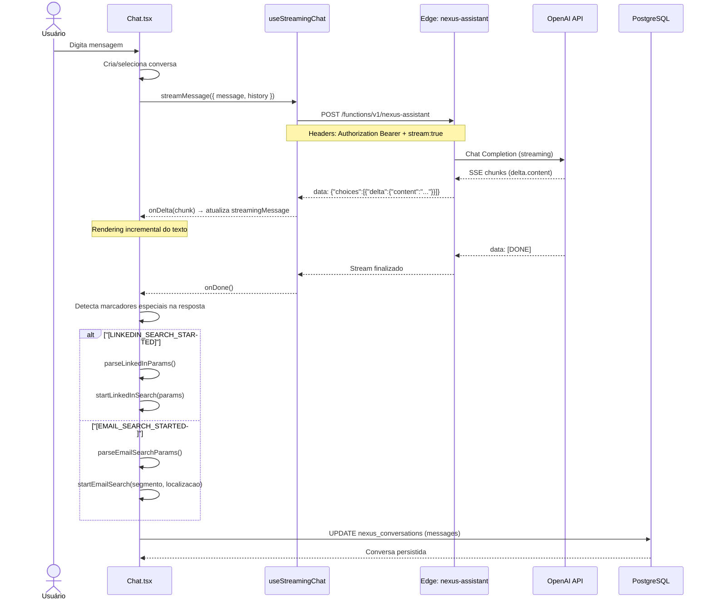
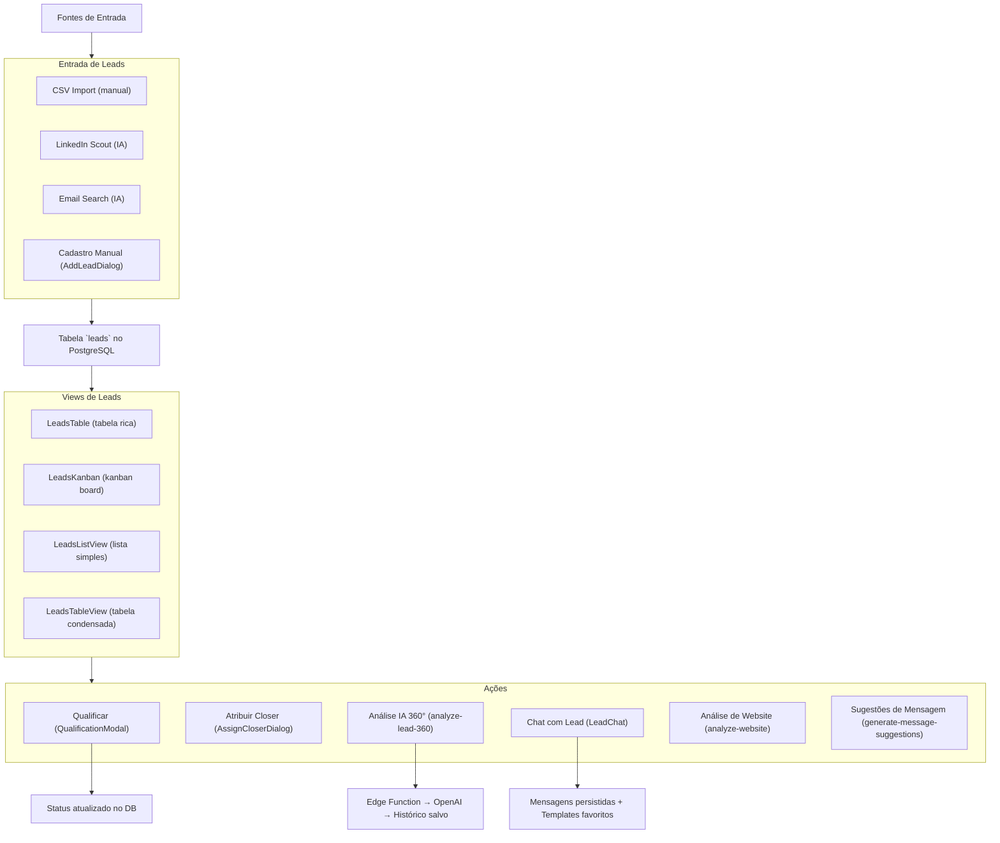
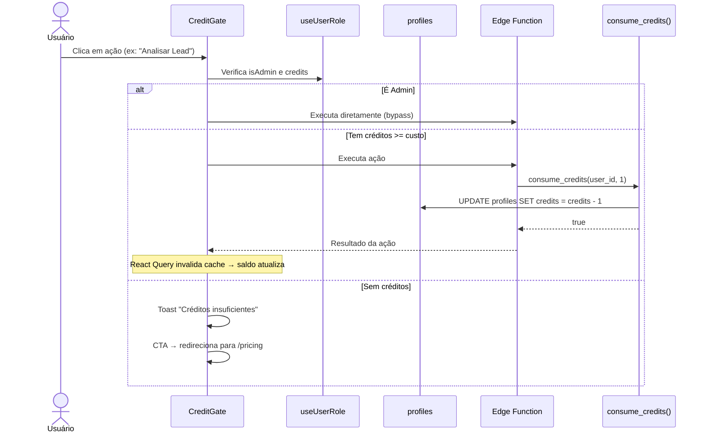
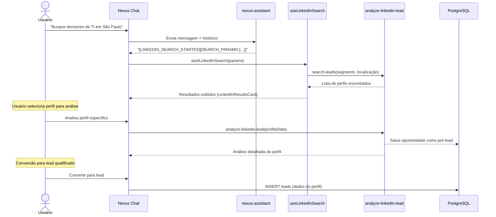
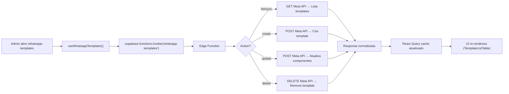
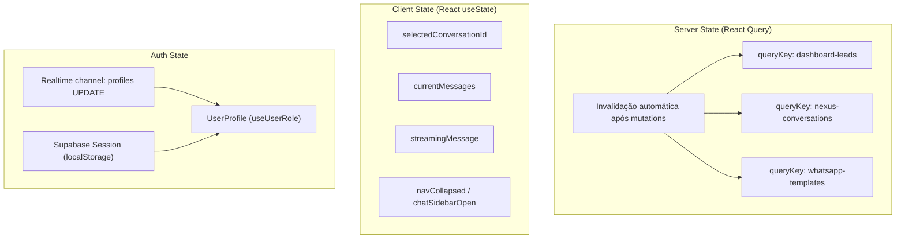
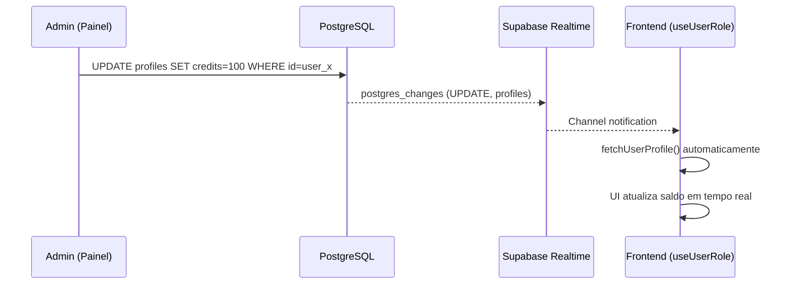

---
tags:
  - nexus
  - fluxo-de-dados
  - dados
created: 2026-04-03
parent: "[[Nexus - Index do Projeto]]"
---

# 🔄 Nexus — Fluxo de Dados

> Esta nota documenta como a informação percorre o [[Nexus - Index do Projeto|Nexus]] em cada funcionalidade principal, desde a interação do usuário até a persistência e retorno visual.

---

## 1. Fluxo de Autenticação & Onboarding



**Detalhes importantes:**
- O trigger `handle_new_user()` no banco cria automaticamente o perfil
- Se o email é `rhyanpaablo@gmail.com`, o role é `admin` automaticamente
- O frontend escuta mudanças em `profiles` via **Realtime** para atualizar créditos/role em tempo real

---

## 2. Fluxo do Nexus Chat (IA com Streaming)

Este é o fluxo principal da aplicação — o Nexus Chat funciona como um **hub de comandos** onde a IA interpreta intenções e despacha ações.



**Marcadores especiais na resposta da IA:**

| Marcador | Ação Disparada |
|:---|:---|
| `[LINKEDIN_SEARCH_STARTED]` | Inicia prospecção no LinkedIn |
| `[SEARCH_PARAMS:{ json }]` | Parâmetros extraídos para a busca |
| `[EMAIL_SEARCH_STARTED]` | Inicia busca por e-mail |
| `[EMAIL_SEARCH_PARAMS:{ json }]` | Parâmetros da busca por email |

> [!important] Padrão Command via Chat
> A IA não é passiva — ela interpreta a intenção do usuário e **orquestra ações**. O chat é essencialmente um **command bus** natural language → action.

---

## 3. Fluxo de Gestão de Leads



**Ciclo de vida de um lead:**
```
Novo → Primeiro Contato → Qualificado → Proposta → Negociação → Fechado (Ganho/Perdido)
```

---

## 4. Fluxo de Créditos (Zero Trust)



**Regras de crédito:**
- **Ações de leitura** (listar leads, ver dashboard, ler histórico): **0 créditos**
- **Ações de mutação** (enviar mensagem, analisar com IA, gerar conteúdo): **1 crédito**
- **Admin**: bypass total (sem consumo de créditos)

---

## 5. Fluxo de Prospecção LinkedIn



---

## 6. Fluxo de WhatsApp Templates



**Fluxo de credenciais:**
1. Frontend chama Edge Function
2. Edge Function busca `integration_configs WHERE user_id AND integration_key='whatsapp'`
3. Extrai `waba_id` + `access_token` do campo JSON `config`
4. Usa credenciais para chamar a Meta Graph API

---

## 7. Fluxo de Estado (State Management)



**Estratégia de cache:**
- `staleTime: 5 min` para dados do dashboard
- `gcTime: 10 min` para garbage collection do React Query
- Invalidação imediata após qualquer mutation (create, update, delete)

---

## 8. Fluxo Realtime — Atualização de Perfil



---

## Notas Relacionadas

- [[Nexus - Arquitetura]] — Diagramas de camadas e conexões
- [[Nexus - Mapeamento de Arquivos]] — Onde cada fluxo vive no código
- [[Nexus - Index do Projeto]] — Visão geral do projeto
