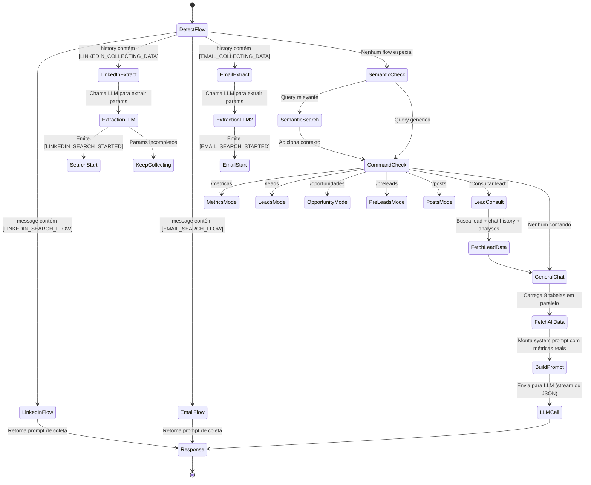

---
tags:
  - nexus
  - backend
  - edge-functions
  - supabase
created: 2026-04-03
updated: 2026-04-05
parent: "[[Nexus - Index do Projeto]]"
---

# ⚡ Nexus — Edge Functions (Deep Dive)

> Documentação detalhada das **20 Edge Functions (Deno/TypeScript)** do backend Supabase. Cada função é autônoma, com CORS, autenticação e logging padronizados.
> 
> Para visão geral da arquitetura: [[Nexus - Arquitetura]]

---

## Padrão Comum de Implementação

Todas as Edge Functions seguem este template (padronizado na [[Sprint 01 - Infra & Segurança]]):

```
1. CORS preflight (OPTIONS → 200)
2. requireAuth(req) → { user, supabase } ou 401
3. consumeCredits(supabase, userId, functionName) → erro 402 se sem créditos
4. [Opcional] getApiKeys(supabase, userId) → chaves por tenant
5. Executar lógica de negócio
6. logger.success({ duration_ms, model, tokens, metadata })
7. Retornar JSON normalizado { data } ou SSE stream
```

> [!tip] Template completo
> Veja o template mínimo completo em [[Nexus - Shared Helpers#Padrão de Uso Completo]].

### Função helper `getApiKeys()`

Presente nas funções de IA. Busca chaves customizadas do tenant antes de usar env vars:

```
1. Tenta buscar openai_api / serper_api em integration_configs (por user_id + is_active)
2. Se encontrar, usa a chave do tenant (multi-tenant)
3. Se não, faz fallback para env vars (OPENAI_API_KEY, LOVABLE_API_KEY, SERPER_API_KEY)
```

### Dual-Model Strategy

O Nexus usa **dois provedores de LLM** com fallback:

| Prioridade | Provedor | API URL | Modelo |
|:---:|:---|:---|:---|
| 1 (Primário) | Lovable AI Gateway | `ai.gateway.lovable.dev/v1/chat/completions` | `google/gemini-3-flash-preview` |
| 2 (Fallback) | OpenAI API | `api.openai.com/v1/chat/completions` | `gpt-4.1` / `gpt-4o-mini` |

> [!important] Modelo primário é Gemini
> Quando `LOVABLE_API_KEY` está configurada, o Nexus Chat usa **Gemini via Lovable Gateway** como primário. OpenAI é o fallback.

---

## 🤖 IA & Análise (9 funções)

### `nexus-assistant` ⭐ (refatorado — [[Nexus - nexus-assistant Arquitetura|Deep dive da arquitetura]])

> **O cérebro do Nexus.** Motor principal do chat com IA. Refatorado de 782 linhas para estrutura modular de 8 módulos na [[Sprint 02 - Observabilidade & Modularização]].

| Input | Output | Modelo |
|:---|:---|:---|
| `{ message, history[], stream: bool }` | SSE stream ou JSON `{ response }` | Gemini / GPT-4.1 |

**Fluxos internos (State Machine):**



**Dados carregados em tempo real (em cada request):**
- 300 últimos leads + aggregações (status, segmento, fonte, cargo)
- 100 oportunidades qualificadas
- 1000 últimas mensagens WhatsApp (n8n_chat_histories_duplicate)
- 100 últimos marketing posts
- 200 pré-leads LinkedIn
- 200 pré-leads Google Maps
- 50 metas de vendas
- Todas as conquistas

**Busca Semântica:**
- Ativada por palavras-chave: "conversa", "disse", "falou", "mencionou", "padrão", "buscar"
- Gera embedding via `text-embedding-ada-002`
- Busca por similaridade via `match_documents()` RPC (top 10)

**Comandos rápidos:**
| Comando | Ação |
|:---|:---|
| `/metricas` | System prompt focado em métricas executivas |
| `/leads` | System prompt focado em leads |
| `/oportunidades` | System prompt focado em pipeline |
| `/preleads` | System prompt focado em pré-leads |
| `/posts` | System prompt focado em marketing |
| `Consultar lead: [nome] - Telefone: [tel]` | Busca lead + chat + análises anteriores |

---

### `analyze-lead-360` → [[EF - analyze-lead-360|Nota detalhada]]

> Análise 360° de um lead para vendas B2B da RP Consultoria.

| Input | Output | Modelo |
|:---|:---|:---|
| `{ lead, messages[] }` | JSON com 9 campos de análise | `gpt-4o-mini` → fallback `gemini-2.5-flash` |

**Retorno (9 campos):** `nextAction`, `leadProfile`, `opportunities`, `painPoints`, `maturityLevel`, `objections`, `approach`, `recommendedSolution`, `solutionFit`

**Portfólio hardcoded da RP Consultoria:** Financeiro, Nexus, Atendimento, Projetos Exclusivos

---

### `analyze-leads-data` → [[EF - analyze-leads-data|Nota detalhada]]
> Análise em batch dos dados agregados de leads.

### `analyze-linkedin-lead` → [[EF - analyze-linkedin-lead|Nota detalhada]]
> Análise aprofundada de um perfil específico do LinkedIn.

### `analyze-opportunities` → [[EF - analyze-opportunities|Nota detalhada]]
> Análise do pipeline de oportunidades qualificadas.

### `analyze-website` → [[EF - analyze-website|Nota detalhada]]
> Análise de website de empresa para enriquecer dados de lead.

### `generate-message-suggestions` → [[EF - generate-message-suggestions|Nota detalhada]]
> Gera sugestões personalizadas de mensagens para abordagem de leads.

### `summarize-chat-history` → [[EF - summarize-chat-history|Nota detalhada]]
> Resume o histórico de conversas WhatsApp de um lead.

### `summarize-meeting-prep` → [[EF - summarize-meeting-prep|Nota detalhada]]
> Prepara briefing de reunião com IA (dados do lead + contexto).

---

## 📝 Conteúdo & Mídia (4 funções)

### `generate-post-caption` → [[EF - generate-post-caption|Nota detalhada]]
> Gera captions otimizadas para postagens de marketing.

### `generate-brand-image` → [[EF - generate-brand-image|Nota detalhada]]
> Gera imagens de marca usando IA (Gemini Image / DALL-E 3 fallback).

### `generate-twitter-carousel` → [[EF - generate-twitter-carousel|Nota detalhada]]
> Gera carrosséis no estilo Twitter Card (5-7 slides).

### `generate-chat-embeddings` → [[EF - generate-chat-embeddings|Nota detalhada]]
> Gera embeddings vetoriais de conversas para busca semântica. De-duplicação implementada (PERF-002 resolvido).

---

## 🔍 Busca & Integração (2 funções)

### `search-leads` → [[EF - search-leads|Nota detalhada]]

> **Busca e qualificação de leads com Inteligência Geográfica** (Google Maps + validação MX).

| Input | Output | API Externa |
|:---|:---|:---|
| `{ segmento, localizacao, num? }` | `{ leads[], results[], business_leads[], total, totalBusinessLeads, noiseBlocked }` | Serper.dev + DNS-over-HTTPS |

**Pipeline de Inteligência (pós-Sprint 2026-04-06):**

1. `requireAuth()` + `consumeCredits(1 crédito)` — Zero Trust
2. `extractMapsLeads()` — filtra `localResults` do Serper, bloqueia redes sociais/recrutamento, normaliza telefone para E.164
3. `transformSerperResults()` — combina orgânico + local com prioridade para Maps
4. `enrichWithValidEmails()` — validação MX via DNS-over-HTTPS
5. `scoreIntents()` — classifica como `high/medium/low`
6. Log em `api_logs` com métricas de ruído filtrado

**Filtros de Ruído (Hard Block):** instagram.com, facebook.com, linkedin.com/jobs, gupy.io, catho.com.br, indeed, vagas.classificadas

> [!important] Regra de Negócio RP Consultoria
> Leads sem website E sem telefone são descartados como "frios demais" para prospecção B2B.

### `whatsapp-templates` → [[EF - whatsapp-templates|Nota detalhada]]

> **CRUD completo** de templates WhatsApp via Meta Graph API v23.0.

| Input | Output | API Externa |
|:---|:---|:---|
| `{ action: "list"│"create"│"update"│"delete"│"sync", ...params }` | `{ success, data, paging, error }` | Meta Graph API |

**Router pattern:** Uma função, 5 ações. Busca credenciais em `integration_configs` WHERE `integration_key='whatsapp_api'`.

**Validações:**
- Nome: regex `^[a-z][a-z0-9_]{0,511}$`
- Template ID: regex `^\d+$`
- Categorias: `MARKETING`, `UTILITY`, `AUTHENTICATION`

**Error mapping:** Converte códigos de erro Meta (190=token expirado, 4=rate limit, 100=param inválido) em mensagens PT-BR.

---

## ⚙️ Sistema (5 funções)

### `process-action` → [[EF - process-action|Nota detalhada]]

> **BFF (Backend for Frontend)** com middleware Zero Trust completo.

| Input | Output | Padrão |
|:---|:---|:---|
| `{ action: "create_lead"│"update_lead"│"create_pre_lead", data }` | `{ success, message }` | Command Handler |

**Middleware chain:**
1. ✅ Auth (JWT válido?)
2. ✅ Email verificado? (`email_confirmed_at`)
3. ✅ Créditos suficientes? (`require_billing_or_credits` + `consume_credits`)
4. ✅ Tenant ownership? (verifica `user_id` do lead antes de update)

### `get-integration-config` → [[EF - get-integration-config|Nota detalhada]]
> Busca config de integração por `user_id` + `integration_key`. Usa `getClaims()` para auth.

### `test-integration` → [[EF - test-integration|Nota detalhada]]
> Testa conectividade de **13 integrações** (Serper, OpenAI, Slack, HubSpot, Pipedrive, ClickUp, Gemini, Meta, WhatsApp, Apollo, Supabase, Uazapi).

### `check-achievements` → [[EF - check-achievements|Nota detalhada]]
> Verifica conquistas (gamificação). JWT obrigatório — userId extraido do token.

### `list-users` → [[EF - list-users|Nota detalhada]]
> Lista todos os usuários. Verificação de role admin obrigatória (`requireAdmin`).

---

## 📁 `_shared/` — Código Compartilhado

Utilitários compartilhados importados via `../_shared/`. Documentação completa: [[Nexus - Shared Helpers]].

| Arquivo | Expoõe | Propósito |
|:---|:---|:---|
| `auth.ts` | `requireAuth()`, `requireAdmin()`, `corsHeaders`, `errorResponse()` | Autenticação JWT e CORS |
| `logging.ts` | `createLogger()`, `logApiCall()` | Logging padronizado para `api_logs` |
| `credits.ts` | `consumeCredits()` | Controle de custos por função |
| `cors.ts` | `corsHeaders` | Legado — prefer `auth.ts` |

---

## Notas Relacionadas

- [[Nexus - Arquitetura]] — Visão de camadas e como functions se conectam
- [[Nexus - Fluxo de Dados]] — Diagramas de sequência das interações
- [[Nexus - Modelo de Dados e Banco]] — Tabelas acessadas pelas functions
- [[Nexus - Regras de Negócio e Segurança]] — Middleware Zero Trust detalhado
- [[Nexus - Stack Tecnológica]] — APIs e provedores utilizados
- [[Nexus - Melhorias e Roadmap]] — Bugs e melhorias identificadas nas functions
