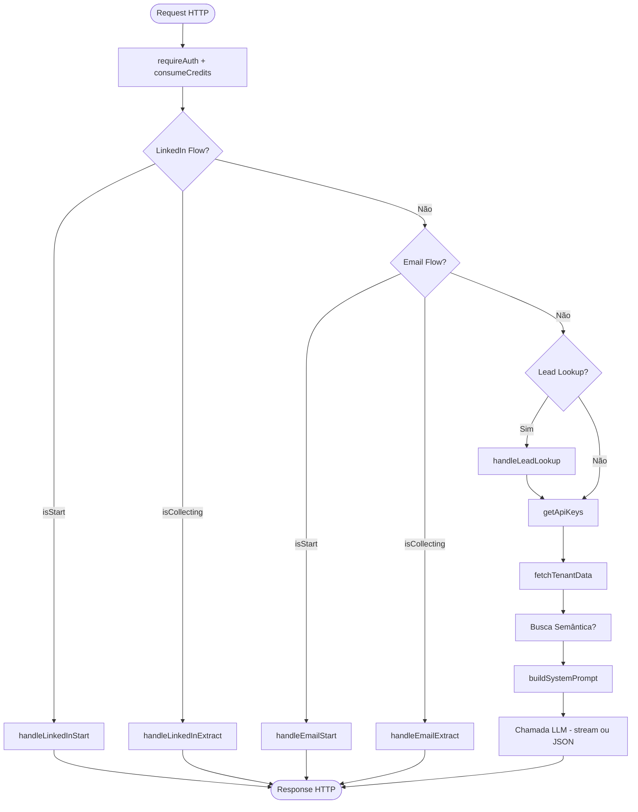

---
tags:
  - nexus
  - backend
  - edge-functions
  - arquitetura
created: 2026-04-05
parent: "[[Nexus - Edge Functions]]"
---

# 🏗️ nexus-assistant — Arquitetura Modular

> O `nexus-assistant` foi refatorado de um arquivo monolítico de **782 linhas** para uma estrutura modular de **8 módulos** durante a [[Sprint 02 - Observabilidade & Modularização]].

---

## Estrutura de Módulos

```
supabase/functions/nexus-assistant/
├── index.ts             → Orquestrador: roteamento de flows + HTTP response (~160 linhas)
├── types.ts             → Interfaces TypeScript: ApiKeys, TenantData, FlowResult
├── api-keys.ts          → Busca API keys por tenant em integration_configs
├── data-fetcher.ts      → Fetch paralelo das 8 tabelas com filtro de tenant
├── prompt-builder.ts    → Construção do system prompt + resolveCommandOverride()
└── flows/
    ├── linkedin.ts      → LinkedIn Scout flow (detect / start / extract)
    ├── email.ts         → Email Search flow (detect / start / extract)
    └── lead-lookup.ts   → "Consultar lead:" - query enriquecida com hist. e análises
```

---

## Responsabilidades por Módulo

### `index.ts` — Orquestrador

É o único arquivo que conhece o protocolo HTTP. Responsável por:
1. Inicializar `supabase`, autenticar o usuário (JWT), criar o `logger`
2. Delegar para o flow correto (LinkedIn → Email → Regular)
3. Consumir créditos (`consumeCredits`)
4. Buscar dados do tenant e montar o system prompt
5. Chamar o LLM (streaming ou JSON)
6. Retornar a `Response` HTTP

> [!important] Regra de ouro
> `index.ts` **não deve conter lógica de negócio**. Se você está adicionando uma nova funcionalidade de chat, crie um novo flow em `flows/`.

---

### `types.ts` — Contratos de Interface

```typescript
interface ApiKeys {
  openaiKey: string | undefined;
  lovableKey: string | undefined;
  serperKey: string | undefined;
}

interface TenantData {
  leads: any[];
  opportunities: any[];
  chatHistories: any[];
  marketingPosts: any[];
  preLeadsLinkedIn: any[];
  preLeadsGoogleMaps: any[];
  salesGoals: any[];
  achievements: any[];
}
```

---

### `api-keys.ts` — Resolução de Chaves por Tenant

Prioridade: **chave do tenant** (em `integration_configs`) > **env var** (fallback global).

```typescript
// Suporta: openai_api, serper_api
const apiKeys = await getApiKeys(supabase, userId);
```

---

### `data-fetcher.ts` — Fetch Paralelo Multi-tabela

Executa 8 queries em `Promise.all()` com filtro de tenant (`eq("user_id", userId)`).

```typescript
const tenantData = await fetchTenantData(supabase, userId);
// Retorna: leads, opportunities, chatHistories, marketingPosts,
//          preLeadsLinkedIn, preLeadsGoogleMaps, salesGoals, achievements
```

> [!tip] Oportunidade de cache
> Este módulo é o candidato ideal para implementação de cache Redis/KV (PERF-001 pendente). O `index.ts` não precisaria mudar — apenas este módulo.

---

### `prompt-builder.ts` — Geração de Contexto

Função pura (sem side effects) que recebe `TenantData` e retorna o system prompt formatado.

```typescript
// Constrói system prompt com todos os dados
const systemPrompt = buildSystemPrompt(tenantData, semanticContext, commandOverride);

// Resolve o override baseado no comando (/metricas, /leads, etc.)
const commandOverride = resolveCommandOverride(message);
```

**Estrutura do system prompt:**
```
[Definição de persona]
[Contexto semântico (busca vetorial)]
[Métricas gerais]
[Leads detalhados (top 15)]
[Oportunidades (top 10)]
[Pré-leads LinkedIn (top 20)]
[Pré-leads Google Maps (top 20)]
[Posts de marketing (top 10)]
[Estatísticas de conversas]
[Metas de vendas (top 5)]
[Conquistas (top 5)]
[Comandos disponíveis]
[Sobre o sistema]
[Diretrizes de resposta]
[Command override]
```

---

### `flows/linkedin.ts` — LinkedIn Scout

Implementa a state machine de prospecção LinkedIn em 3 funções:

```typescript
detectLinkedInFlow(message, history)
// → { isStart: bool, isCollecting: bool }

handleLinkedInStart()
// → string (prompt de coleta de dados)

handleLinkedInExtract(message, apiKeys)
// → string | null (confirmação com params extraídos, ou null se incompleto)
```

**Marcadores emitidos:**
- `[LINKEDIN_COLLECTING_DATA]` — aguardando dados do usuário
- `[LINKEDIN_SEARCH_STARTED]` — params coletados, busca iniciada
- `[SEARCH_PARAMS:{"cidade":...,"estado":...,"cargo":...}]` — params para o hook frontend

---

### `flows/email.ts` — Email Search

Espelho do LinkedIn flow para busca de e-mails de compradores:

```typescript
detectEmailFlow(message, history)
handleEmailStart()
handleEmailExtract(message, apiKeys)
```

**Marcadores emitidos:**
- `[EMAIL_COLLECTING_DATA]`
- `[EMAIL_SEARCH_STARTED]`
- `[EMAIL_SEARCH_PARAMS:{"segmento":...,"localizacao":...}]`

---

### `flows/lead-lookup.ts` — Consulta de Lead

Detecta e processa o comando `"Consultar lead: [nome] - Telefone: [tel]"`:

```typescript
isLeadLookup(message)  // → bool

handleLeadLookup(message, supabase, userId)
// → string (userPrompt enriquecido com dados do lead)
```

**Dados incluídos no prompt:**
- Dados completos do lead
- Últimas 20 mensagens WhatsApp
- Últimas 5 análises de IA anteriores

---

## Diagrama de Fluxo



---

## Como Adicionar um Novo Flow

1. Criar `flows/meu-flow.ts` com `detectMeuFlow()`, `handleMeuFlowStart()`, `handleMeuFlowProcess()`
2. Importar no `index.ts` e adicionar checagem antes do bloco "REGULAR FLOW"
3. Definir os marcadores `[MEU_FLOW_*]` para coordenação com hooks do frontend
4. Atualizar `prompt-builder.ts` com o novo comando rápido (se necessário)

---

## Notas Relacionadas

- [[EF - nexus-assistant]] — Documentação funcional (inputs, outputs, comportamento)
- [[Nexus - Shared Helpers]] — Módulos `auth`, `logging` e `credits` utilizados
- [[Sprint 02 - Observabilidade & Modularização]] — Contexto da refatoração
- [[Nexus - Melhorias e Roadmap]] — PERF-001 (cache) ainda pendente para este módulo
